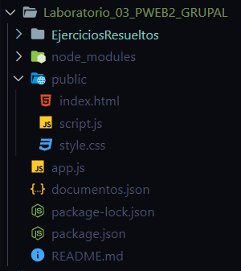



||
**UNIVERSIDAD NACIONAL DE SAN AGUSTIN**

**FACULTAD DE INGENIERÍA DE PRODUCCIÓN Y SERVICIOS**

**ESCUELA PROFESIONAL DE INGENIERÍA DE SISTEMA**
||
| :-: | :-: | :-: |
|**Formato:** Guía de Práctica de Laboratorio / Talleres / Centros de Simulación|
|**Aprobación:  2022/03/01**|**Código: GUIA-PRLE-001**|**Página:** |

**INFORME DE LABORATORIO**

|**INFORMACIÓN BÁSICA**|
| :-: |
|**ASIGNATURA:** |`		`Programación Web 2|
|**TÍTULO DE LA PRÁCTICA:** |`           	`*Ajax y NodeJS*|
|**NÚMERO DE PRÁCTICA:**|`         `*03*|**AÑO LECTIVO:**|`        `*2023*|**NRO. SEMESTRE:**|`            `*III*|
|**FECHA DE PRESENTACIÓN**|`    `*29/05/23*|**HORA DE PRESENTACIÓN**|`     `*2:00 PM*|
|
**INTEGRANTE (s):** 

- Hilacondo Begazo Andre Jimmy

- Layme Mamani Gonzalo Rail

- Soto Ccoya Gabriel Eduardo

- Delgado Allpan Andre David

- Chirinos Negron Sebastian Arley

|**NOTA:**|* |
|
**DOCENTE(s):**

                           
|

|**SOLUCIÓN Y RESULTADOS**|
| :-: |
|
I. **SOLUCIÓN DE EJERCICIOS/PROBLEMAS**     

**           

**LINK REPOSITORIO**: <https://github.com/GonzaloRail/Laboratorio_03_PWEB2_GRUPAL.git>

Este sistema fué desarrollado usando estas tecnologías:

- HTML y CSS

- El Framework Express basado en NodeJS para el BackEnd

- Los archivos se guardaron en Sistema de Archivos del Sistema Operativo del Servidor a través de la dependencia nativa File System (fs).

- JavaScript para el FrontEnd

- Las páginas se escriben en lenguaje Markdown

- Se utilizó la dependencia markdown-it

- La comunicación entre el Cliente y el Servidor se hizo usando JSON de manera asíncrona.

**Install dependencies**

npm install

**Run the app**

node app.js

- **Resolución:**

**                 Fig 1. Estructura del sistema                                          Fig 2. Servidor iniciado (sin css)

- **Servidor**

Cuando se recibe una solicitud POST en esa ruta, se obtienen los valores de los campos "titulo" y "contenido" del cuerpo de la solicitud. Luego se inserta un nuevo elemento con esos valores en el archivo JSON documentos.json. Finalmente, se envía una respuesta con un mensaje de éxito.

Lee el contenido del archivo documentos.json y se envía como respuesta con un encabezado que indica que es un archivo JSON.

Cuando se recibe una solicitud POST en esa ruta, se obtiene el valor del campo "contenido" del cuerpo de la solicitud. Luego, se convierte ese contenido de Markdown a HTML utilizando markdown-it. Finalmente, se envía una respuesta con el contenido HTML generado.

- **Ejecución:**

***Fig. 01 “Creando un formulario”***

**e**

***Fig. 02  “Alert del formulario”***

En el formulario llenamos el área del contenido usando MARKDOWN ***(Fig 01)*** pero sin título. Este nos enviará una alerta de que no llenamos el título ***(Fig 02)***:  ****

***Fig. 03  “Creando archivo  ‘Prueba4’ ’”***

Su título será “Prueba4” ***(Fig 03)***.

Visualizamos el archivo “Prueba4” en la lista ***(Fig 04)***.

***Fig. 04  “Visualizando el archivo archivo ‘Prueba4’ ’”***

 

También podremos visualizar el contenido si presionamos en el nombre del archivo que queramos ver:

***Fig. 05  “Contenido del archivo archivo ‘Prueba4’ ’”***

II. **CUESTIONARIO**

- **En el Ejemplo "Hola Mundo" con NodeJS. ¿Qué pasó con la línea: "Content type ….."?**

No se necesita especificar explícitamente el tipo de contenido en la respuesta con res.setHeader('Content-type', 'text/html') porque el cliente puede traducir la respuesta utilizando una plantilla HTML predeterminada. En este caso, el mensaje se muestra dentro de un elemento <pre>. Sin embargo, al usar res.setHeader('Content-type', 'text/html'), el cliente interpretará que deseamos ver la respuesta en un formato específico. Si se utiliza HTML, el mensaje se mostrará sin etiquetas dentro del cuerpo (<body>) del documento.

- **En los ejercicios. ¿En qué lugar debería estar el archivo poema.txt?**

Debería estar en la carpeta priv, tal como se le indica en la dirección que recibe path.resolve

- **¿Entiende la expresión regular en el código y se da cuenta de para qué es útil?**

Modifica el texto en formato HTML para que los saltos de línea representados por \n sean reemplazados por la etiqueta  , de manera que el contenido se visualice en el navegador de la misma forma que está en el archivo de texto original.

- **Note que la respuesta del servidor está en formato JSON, ¿Habrá alguna forma de verla directamente?**

Se puede utilizar response.send() para enviar cadenas y arrays sin necesidad de usar JSON, de forma que la información se muestra directamente.

|
|
**CONCLUSIONES**

*Durante el desarrollo de este proyecto, se lograron alcanzar los siguientes objetivos y conclusiones clave:*

- *Aprender peticiones asíncronas en JavaScript usando JSON: Se comprendió la importancia de utilizar JSON para la comunicación de datos. Esto permite una interacción dinámica con servidores o APIs sin necesidad de recargar la página.*

- *Programar en el Backend usando JavaScript: Se exploraron herramientas como Node.js y Express.js para programar en el backend utilizando JavaScript. Se comprendió cómo crear servidores web, manejar solicitudes y respuestas, y desarrollar la lógica de negocio en el backend. Esto brinda versatilidad y eficiencia en el desarrollo de aplicaciones web completas.*

- *Entender las promesas y los objetos no bloqueantes: Se obtuvo una comprensión sólida de las promesas y los objetos no bloqueantes. Las promesas proporcionan una forma estructurada de manejar tareas asíncronas, evitando el anidamiento excesivo de callbacks. Los objetos no bloqueantes permiten que otras tareas se ejecuten sin interrupciones mientras se realizan operaciones asíncronas, mejorando el rendimiento de la aplicación.*

|

|**RETROALIMENTACIÓN GENERAL**|
| :-: |
|

|

|**REFERENCIAS Y BIBLIOGRAFÍA**|
| :-: |
|
**References**

- *JavaScript code using the latest ECMAScript. Packt Publishing Ltd, 2018.*

- *Greg Lim. Beginning Node.js, Express & MongoDB Development. Amazon, 2019.*

- *https://www.w3schools.com/nodejs/nodejs\_intro.asp*

- *https://nodejs.org/en/docs/guides/getting-started-guide/*

- *https://nodejs.dev/learn*

- *https://www.w3schools.com/js/js\_api\_fetch.asp*

- *https://expressjs.com/es/*

- *https://developer.mozilla.org/es/docs/Web/API/Fetch\_API/Using\_Fetch*

- *https://developer.mozilla.org/es/docs/Learn/Server-side/Express\_Nodejs/Introduction*

|
  

